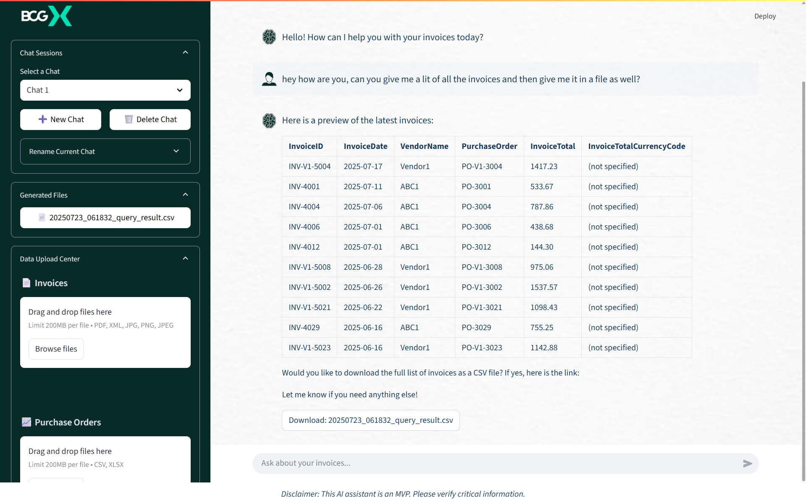

# Invoice Processing AI Assistant

A sophisticated, conversational AI agent for querying and managing invoice data, powered by Streamlit and a serverless Azure backend.

This application provides a user-friendly chat interface to interact with a powerful AI assistant. Users can upload invoices, purchase orders, and contracts, and then ask complex questions in natural language. The AI agent can query a SQL database with advanced fuzzy matching, generate reports, and even send emails with user consent, streamlining complex business intelligence tasks.

---

## Key Features

- **Conversational AI Agent**: Interact with your data using plain English. Ask complex questions, and the agent will understand your intent and perform the necessary actions.

- **Automated Document Processing**: Upload a PDF invoice, and the system uses an AI vision model (`gpt-4-vision`) to automatically extract its contents into a structured format for database entry.

- **Advanced SQL Search with Fuzzy Matching**: The agent can query the database to find invoices, POs, or contracts. It features a powerful, custom-built `SIMILARITY` function that finds matches even with typos or partial information.

- **On-the-Fly File Generation**: Ask the agent to export query results to a `CSV` file or generate a formal `PDF Verification Report`. Files are created securely and delivered via a temporary download link.

- **Secure, Consent-Based Email Workflow**: The agent can compose and send emails, but only after you review and approve a draft in the chat window. API keys are securely handled on the backend and never exposed to the client.

- **Multi-Session Management**: The sidebar allows you to create, rename, and switch between multiple chat sessions, keeping your conversations organized and context-aware.

---

## Application in Action


*Application answering user's query and providing relevant files,  it can be downloaded by the user, mailed to someone as well.*


---

## Part 2: Technical Setup and Configuration

This section provides a detailed guide for provisioning the necessary cloud infrastructure and configuring the project for local development.

### Azure Infrastructure Setup

This project requires several Azure services. The following steps guide you through provisioning the necessary infrastructure via the [Azure Portal](https://portal.azure.com).

#### 1. Azure Resource Group

First, create a Resource Group to hold all the project's resources, ensuring easy management and cleanup.

1.  Navigate to the Azure Portal and select `Resource groups`.
2.  Click `Create`, choose your subscription, and provide a name.
3.  Choose a region and click `Review + create`.

#### 2. Azure Storage Account

The storage account is critical for triggering the data ingestion functions and storing generated files.

1.  In the Azure Portal, click `Create a resource` and search for `Storage Account`.
2.  Select your new Resource Group and provide a unique name.
3.  After creation, navigate to the Storage Account and go to the `Containers` section.
4.  Create a container named `invoices`. The application will create subdirectories inside it automatically.
5.  Go to the `Access keys` section and copy one of the **Connection strings**. You will need this for both the `BLOB_CONNECTION_STRING` and `AzureWebJobsStorage` settings.

#### 3. Azure OpenAI Service

This service provides the AI models for the agent and vision capabilities.

1.  Click `Create a resource` and search for `Azure OpenAI`.
2.  Select your Resource Group and give the service a name.
3.  Navigate to the created service and go to `Model deployments` under `Management`.
4.  You must deploy two models:
    -   **Agent Model**: An instruction-following model like `gpt-4`. Give it a deployment name (e.g., `invoice-agent`). This name is your `AZURE_OPENAI_AGENT_DEPLOYMENT_NAME`.
    -   **Vision Model**: A multimodal model like `gpt-4-vision-preview`. Give it a deployment name (e.g., `invoice-vision`). This name is your `AZURE_OPENAI_VISION_DEPLOYMENT_NAME`.
5.  From the `Keys and Endpoint` section, copy the **API Key** and **Endpoint URL**.

#### 4. Azure SQL Database

This service will store all structured data from invoices, POs, and contracts.

1.  Click `Create a resource` and search for `SQL Database`.
2.  You will first need to create a `SQL server`. Provide a server name, admin login, and a secure password.
3.  Configure the database name (e.g., `InvoiceDB`).
4.  After creation, navigate to the `SQL Server` resource (not the database).
5.  Go to `Networking` -> `Public access`. Click `Add your client IP address` to allow local testing, and check the box for `Allow Azure services and resources to access this server`.
6.  Construct your `SQL_CONNECTION_STRING`. It will follow this format: 
```
Driver={ODBC Driver 18 for SQL Server};Server=tcp:YOUR_SERVER_NAME.database.windows.net,1433;Database=YOUR_DATABASE_NAME;Uid=YOUR_ADMIN_LOGIN;Pwd={YOUR_PASSWORD};Encrypt=yes;TrustServerCertificate=no;Connection Timeout=30;
```

#### 5. Azure Function App

This is the serverless compute that runs all the backend logic.

1.  Click `Create a resource` and search for `Function App`.
2.  Select your Resource Group and provide a globally unique name.
3.  Set the `Runtime stack` to `Python` (e.g., version 3.9).
4.  On the `Hosting` tab, select the Storage Account you created earlier.

### External Services Setup

#### Brevo (for Email)

This service is used for sending emails.
1.  Create an account at `Brevo.com`.
2.  Navigate to `SMTP & API`.
3.  Generate an `API key` and note it down. This is your `BREVO_API_KEY`.
4.  Note the email address you will send from. This is your `BREVO_SENDER_EMAIL`.

### Local Project Setup

This guide will get the project running on your local machine.

#### 1. Prerequisites & Installation

-   Ensure you have Python 3.9+, Git, and the [Azure Tools for VS Code](https://marketplace.visualstudio.com/items?itemName=ms-vscode.vscode-node-azure-pack) extension pack

- Make sure to install the [Azure CLI](https://learn.microsoft.com/en-us/cli/azure/install-azure-cli-windows?view=azure-cli-latest&pivots=msi) as well to be able to run it locally 
-   Clone the repository :

    `git clone <your-repo-url>`
    
    `cd <your-repo-directory>`
    
    `python -m venv .venv`
    
    `source .venv/bin/activate` (On Windows, use `.venv\Scripts\activate`)

#### 2. Backend Configuration (`local.settings.json`)

Create a file named `local.settings.json` in the project root. This file stores your secrets for local development and is excluded by `.gitignore`. Populate it with the credentials you gathered from Azure.
```
{
    "IsEncrypted": false,
    "Values": {
        "FUNCTIONS_WORKER_RUNTIME": "python",
        "AzureWebJobsFeatureFlags": "EnableWorkerIndexing",
        "AzureWebJobsStorage": "Paste Storage connection string here",
        "BLOB_CONNECTION_STRING": "Paste Storage connection string here",
        "SQL_CONNECTION_STRING": "Paste SQL connection string here",
        "AZURE_OPENAI_API_KEY": "Paste your AOAI Key here",
        "AZURE_OPENAI_ENDPOINT": "Paste your AOAI Endpoint URL here",
        "AZURE_OPENAI_AGENT_DEPLOYMENT_NAME": "invoice-agent",
        "AZURE_OPENAI_VISION_DEPLOYMENT_NAME": "invoice-vision",
        "BREVO_API_KEY": "Paste your Brevo API Key here",
        "BREVO_SENDER_EMAIL": "your-sender@email.com",
        "API_ENDPOINT": "http://localhost:7071/api/invoice_agent_chat",
        "API_CODE": "",
        "INCOMING_BLOBS_PATH_PATTERN": "invoices/incoming/",
        "FINAL_REPORTS_PATH_PATTERN": "invoices/reports/",
        "SQL_REPORTS_PATH_PATTERN": "invoices/sql-load/",
        "PO_DATA_PATH_PATTERN": "invoices/master/",
        "CONTRACTS_PATH_PATTERN": "invoices/contracts/"
    }
}
```

#### 3. Frontend Configuration (`.streamlit/secrets.toml`)

Create a file at `.streamlit/secrets.toml` to store secrets for the Streamlit app.

`# For local development`
`API_ENDPOINT = "http://localhost:7071/api/invoice_agent_chat"`
`API_CODE = "" `

`# For deployed app`
`# API_ENDPOINT = "https://<your-function-app-name>.azurewebsites.net/api/invoice_agent_chat"`
`# API_CODE = "<your-function-key>"`

#### 4. Database Initialization

The database tables are created automatically the first time a function attempts to connect to them, thanks to the initialization checks within `shared_code/database_service.py`. No manual schema creation is needed.